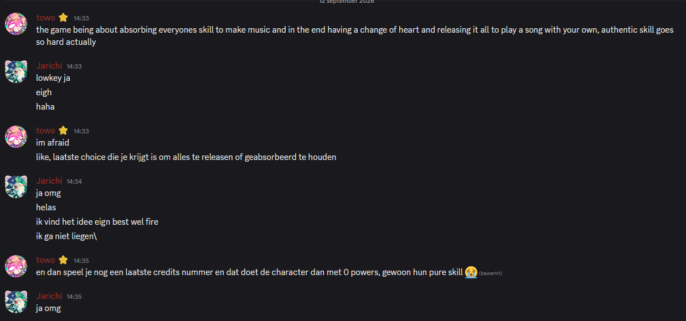

# bespreekpunten
- flowchart van battle
- scope
- playtest
- field research
- visuele identity 

# scope
prototype-0.1.0 bevat:
- simpel startscherm
- toggle voor aan/uit leadinstrument bij mis spelen
- battle system

# rhythm engine
- als je ass speelt, klinkt je solo ook ass
    - versie maken waarbij lead instrument wegvalt als je mis speelt

# field research
- https://www.wardrumgame.com/?pgid=mhkj1tn2-b28e6ba3-5922-45de-9204-dbc683bd5c3b

# battle system
- 1 player en 1 botplayer opponent
- elke player heeft een set HP.
- bot heeft paar inaccuracies, misschien minder hp (kan nog tweaken).
- alleen nog maar rhythm game skill, nog geen strategy
- satisfying gevoel, intensiteit afhankelijk van hoeveel punten/damage
- muziek loopt tot de battle voorbij is - dat gebeurt als iemand dood is
- turns zijn time-sensitive

# buiten scope:
- intensiteit opvoeren na X aantal loops, OF afhankelijk van health
- hogere intensiteit betekent, kortere pauzemomenten, snellere riffs, evt damage nemen bij fouten
- moves zijn "riffs" met effecten die de rhythm game kunnen aanpassen van jou of de opponent
- monsterstjes zijn instrumenten
- lineaire story met af en toe sidequests voor loot
- bepaalde instrumenten doen meer/minder damage depending on waar in het nummer wordt gespeeld
- je absorbeert enemies in je magische instrument 

# story
